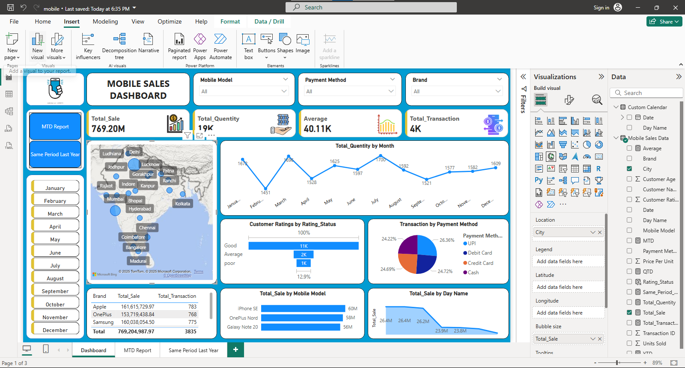

# 📊 Mobile Sales Dashboard (Power BI Project)

## 🔹 Project Line / Headline  
Mobile Sales Data Analysis & Visualization using Power BI  

## 🔹 Short Description / Purpose  
This project analyzes mobile sales data to track **total sales, transactions, customer ratings, and payment methods**.  
It provides an **interactive dashboard** that helps stakeholders monitor performance across **time, location, and product categories**.  

## 🔹 Tech Stack  
- **Power BI** → Data visualization & dashboarding  
- **Excel / CSV** → Data source  
- **DAX** → Measures & calculations  

## 🔹 Data Source  
- Mobile sales dataset (Excel file) containing:  
  - Sales & transaction details  
  - Mobile brands & models  
  - Customer demographics & ratings  
  - Payment methods  
  - City & regional sales distribution  

## 🔹 Feature Highlights  
### 📌 Dashboard (Overview)  
- KPIs: Total Sales, Total Quantity, Average Sales, Total Transactions  
- Sales by City (map visualization)  
- Sales by Brand & Mobile Model  
- Customer Ratings Analysis  
- Transactions by Payment Method  

### 📌 MTD (Month-to-Date) Report  
- Sales trend by Year, Quarter, Month, and Day  
- Cumulative sales growth visualization  

### 📌 Same Period Last Year Report  
- Year-over-Year, Quarter-over-Quarter, and Month-over-Month comparisons  
- Identify seasonal sales patterns & growth trends  

## 🔹 Business Impact  
- Provides a **comprehensive view of sales performance** across multiple dimensions.  
- Helps identify **top-performing brands, models, and cities**.  
- Supports **data-driven decision-making** for marketing, sales strategies, and inventory planning.  
- Enables monitoring of **customer satisfaction & payment preferences**.  

## 🔹 Screenshot Demo  

### 📊 Dashboard  
  

### 📈 MTD Report  
  

### 📉 Same Period Last Year  
  

---
✨ Developed with **Power BI** to turn raw data into business insights.
