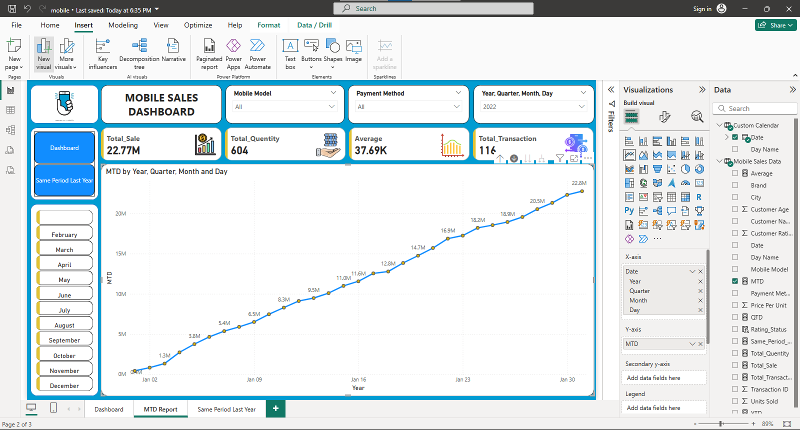
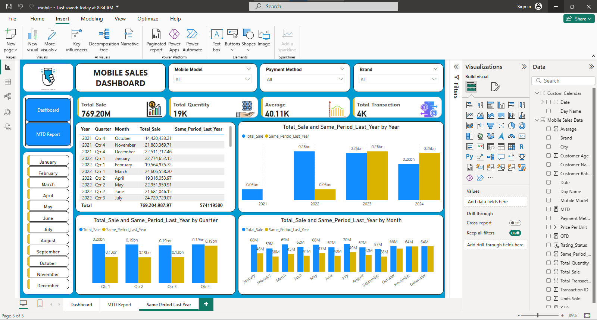

#📊 Mobile Sales Dashboard (Power BI Project)
🔹 Project Line / Headline

Mobile Sales Data Analysis & Visualization using Power BI

🔹 Short Description / Purpose

This project analyzes mobile sales data to track total sales, transactions, customer ratings, and payment methods. It provides an interactive dashboard that helps stakeholders monitor performance across time, location, and product categories.

🔹 Tech Stack

Power BI (Data visualization & dashboarding)

Excel / CSV (Data source)

DAX (Measures & calculations)

🔹 Data Source

Mobile sales dataset (Excel file) containing:

Sales & transaction details

Mobile brands & models

Customer demographics & ratings

Payment methods

City & regional sales distribution

🔹 Feature Highlights

Dashboard (Overview):

Total Sales, Total Quantity, Average Sales, Total Transactions

Sales by city (map visualization)

Sales by brand & mobile model

Customer ratings analysis

Transactions by payment method

MTD (Month-to-Date) Report:

Sales trend by year, quarter, month, and day

Cumulative growth visualization

Same Period Last Year Report:

Year-over-year, quarter-over-quarter, and month-over-month sales comparison

Identify seasonal sales patterns and growth trends

🔹 Business Impact

Provides a comprehensive view of sales performance across multiple dimensions.

Helps identify top-performing brands, models, and cities.

Supports data-driven decision-making for marketing, sales strategies, and inventory planning.

Enables monitoring of customer satisfaction & payment preferences.

🔹 Screenshot Demo
📌 Dashboard

📌 MTD Report

📌 Same Period Last Year

